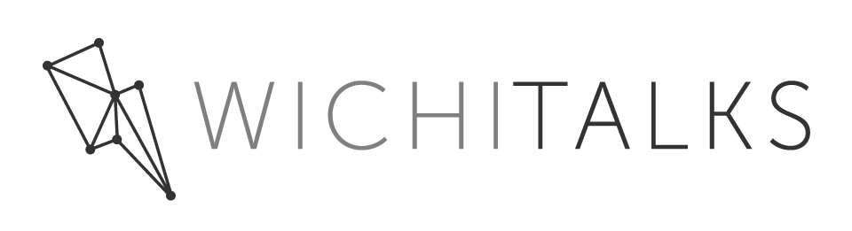

>FAQ - What’s with the lightning bolt logo?

If you look at Wichita, the Wichitalks logo, and find yourself trying to decipher what it means… well, that’s what I’ll try to answer here.

The first Wichitalks event was thrown together in a frenzy of activity with a deadline of approximately 30 days. That meant that decisions about all sorts of things had to be made quickly under the motto - Done is Better Than Perfect - which creates large constraints placed on any decisions.

The design idea was simple: Create something so bad and clunky that it would enrage my design minded friends such that they couldn’t help but offer to redesign it. I promptly proceeded to powerpoint, picked a font, background color, and browsed the clip art section until I found something that just remotely made some sense. The lightning bolt was selected for the ‘lightning talk’ style of Wichitalks, which are a heavy shots of passion in rapid-fire succession. The result of which is the following image…

Much to my dismay, it wasn’t below the bar enough and the logo stuck with us through the first event. The incredible fortune and luck of the event led to its early success. We packed out the Labor Party on a cold Friday evening.

So, now we’ve got a real event that needs some nurturing. I turned to my friend and designer [Barrett Morgan][Barrett Morgan] to have him generate a more professional logo. In no way was Wichitalks married to the lightning bolt, so we tried a variety of different logos and yet none of them stuck. The only one that remained captivating was the bolt; thus, the new bolt emerged.

I’m a fan of minimal design, and the bolt he showed me captured my attention. The different nodes and the way each line is connected to the other jumped out as if to say ‘Wichitalks connects people/ideas/activities/awareness’… you name it. It’s a decentralized network where everything is related to everything else in some fashion -- much like a thriving culture, much like Wichita. It’s not a zero-sum game, the success of others leads to personal success. A rising tide floats all boats, as the adage goes.

Sure, I could’ve spent more time obsessing over the logo and what it means, but who has time for that? Besides, it’s not the logo that makes Wichitalks, it’s Wichitalks that makes the logo. Who cares what it means, what matters is how it makes you feel. If you come to a Wichitalks and the ideas you hear or the people you meet inspire you in some way, then that’s what will be remembered when you see the logo. There’s no hidden message, no conspiracy if you take the image and look at the negative reflected across 35 degrees off the vertical. Trust me, don’t go looking for it. Just come out and support sharing the ideas of your neighbors. We’re all just here to learn and have a good time.

Stay cool,  
Kevin

[Barrett Morgan]: http://www.barrettmorgandesignllc.com/
